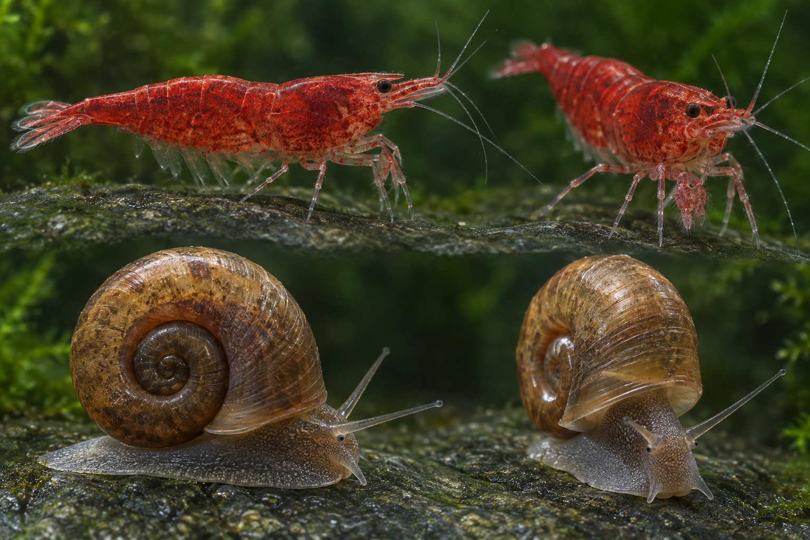

# Cherry shrimp and ramshorn model study

This reference image was generated with the built-in GPT Image tool at the user's request. It is a visual modeling target, not a photograph documenting an animal observation or a source of biological measurements.

The previous rounded prototypes were rebuilt against its silhouettes and material detail. The aquarium still renders volumetric animals from any viewing angle. The reference is not used as a fish-shaped billboard or a fixed background.

| Reference feature | Rotatable model |
| --- | --- |
| Elongated tapered shrimp carapace | Sculpted cross-sections, wedge-shaped front, shortened serrated rostrum and small integrated eyes |
| Overlapping abdomen | Six shaped, overlapping plates with continuous-scale pigmentation and subtle independent flex |
| Thin tail fan | Cupped translucent membranes, separate fine rays, fringing setae and a tapered tail connection |
| Feeding and walking appendages | Five articulated leg pairs; the first two transfer toward the mouth during grazing; separate mouthparts, antennae and swimmerets |
| Ramshorn shell | Fuller joined whorl envelopes, growth striae, a thick aperture lip and recessed inner opening |
| Soft snail body | Sculpted broad contacting sole, mantle and head; moving tapered tentacles, eyes at their bases and small mouth movement |
| Natural surface variation | GPT Image material atlas for chitin, shell and skin, with bump response and restrained underwater highlights |

The material atlas was separately generated from the macro reference. Its three equal panels are sampled as repeating material tiles; they do not contain flattened animal silhouettes. Fine skin texture and shell striation scales are independent of body shape. Existing aquarium scenery, tetra geometry, body waves, depth behavior and schooling are unchanged.

The organisms remain representative realtime models. Microscopic setal anatomy, shell growth, tissue optics and behavior timing are approximations. Their grazing paths and independent clocks are inherited from the existing simulation. The image does not replace the cardinal field evidence documented in [the behavior study](./cardinal-behavior-study.md).

No assets were purchased and no separate paid API was used. The implementation shares geometries, material tiles and render batches across six shrimp and three snails. The full reference loads only when its link is opened.

## Plant contact and swimming update

Low carpet and grass blades now retain only a small fraction of their former movement; the scanned ground ferns also have a restrained current. Taller planting keeps its existing detail and rooted motion.

Seven grazers begin on plant surfaces; two ramshorns remain on the front glass. Leaf paths use barycentric contact on the actual blade triangles and the same deformation and current clock as the renderer. Body-volume checks include neighboring blades, stems and conservative fern-frond envelopes. Crawlers reverse or pause at blocked paths. Shrimp occasionally depart, swim through a checked water path using faster swimmeret strokes, and settle on another leaf. A newly obstructed swimming trip retreats. Independent grazing intervals and gradual turns remain active.

The route search and spatial index are cached; all visible animal and plant geometry is retained. This is an illustrative behavioral model, not measured species locomotion or a physics simulation of individual feet and suction. Fine antennae and individual toe contacts are animated rather than solved separately.
